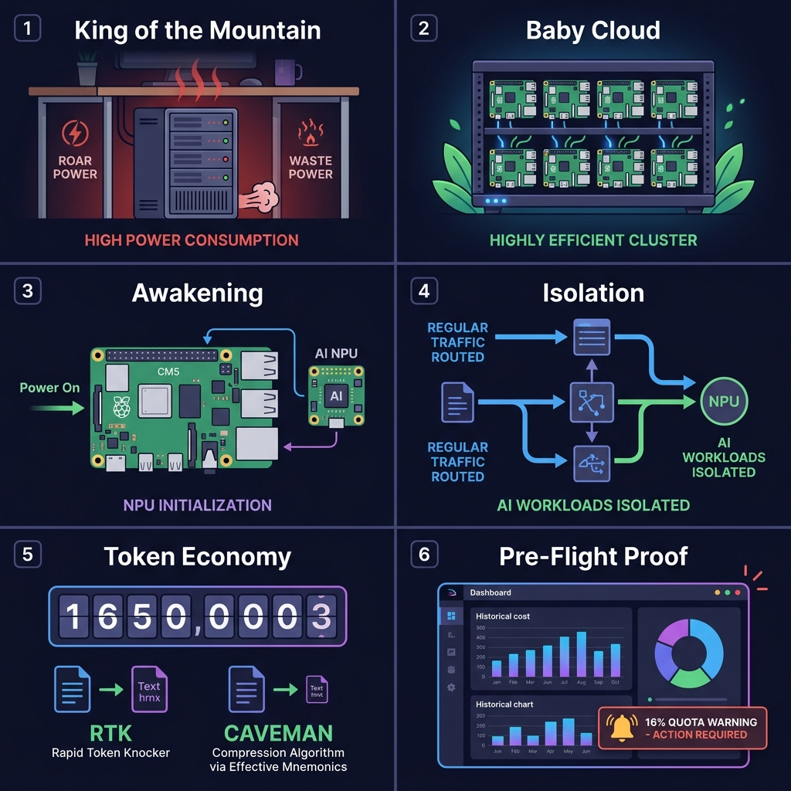
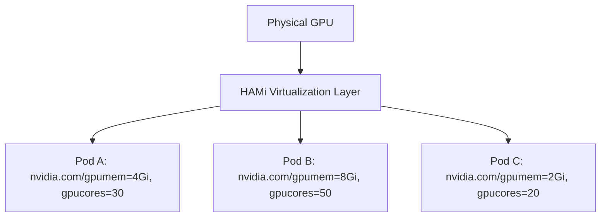

# Storyboard: The Baby Cloud & The Baby Dragon
## Demonstrating Responsible Stewardship on beby.cloud

---

### Act 1: The Threat of "King of the Mountain" (Goliath)
*   **Visual:** A massive, power-hungry workstation running Windows, monopolizing a 24GB GPU for a single developer's basic tasks, locking out researchers and wasting scarce, high-cost public cloud allocation.
*   **Narrative:** In large-scale enterprise and space systems, GPU time is a precious, high-cost commodity. If we default to massive, unshared monolithic instances, we invite resource hoarding and administrative locks. We must show a better, more cooperative path before we ever touch the "big dollar" hardware.
*   **The Philosophy:** We do not test our software or design patterns on the main system for the first time. We build a faithful, cost-effective micro-scale testbed to prove our architecture under tight constraints first.

---

### Act 2: The Baby Cloud & The Baby Dragon (David)
*   **Visual:** A beautiful, energy-efficient 9-node Raspberry Pi cluster on `beby.cloud`, drawing less than 50W. 8 nodes run WebAssembly (SPIN) microservices, while the 9th node—our "Baby Dragon"—runs on a Raspberry Pi CM5 board with a low-power Hailo AI NPU.
*   **Narrative:** We present `beby.cloud`: a micro-cloud running Talos Linux (immutable, API-managed, minimal). 
    *   **8 SPIN Nodes:** Handling high-throughput, low-power Wasm edge logic.
    *   **1 AI Node (`talos-428fe`):** Utilizing a Raspberry Pi CM5 paired with a Hailo AI accelerator for local LLM compute.
*   **The Constraint:** Strictly 8GB memory per node. We cannot use bloated, resource-hogging Frontier models. We must be highly efficient, proving we are responsible stewards of compute.

---

### Act 3: Post-Mortem on Awaking the Baby Dragon
*   **Visual:** The Talos API loads the custom `hailo_pci` driver. The kernel initializes the module: `hailo: Init module. driver version 4.23.0`, but the node immediately locks up and drops offline (100% packet loss).
*   **Narrative:** Attempting to force-bind the legacy `hailo` driver (built for Hailo-8) to the newer Hailo-10H hardware (`1e60:45c4`) caused a system-wide kernel panic/lockup. This validates our David vs. Goliath strategy: we fail fast and safely on a $100 testbed before ever touching expensive telemetry systems. To resolve this, we will transition to the proper `hailo1x_pci` driver or obtain a compiler toolchain to build a compatible kernel module.

---

### Act 4: Cozystack 1.4 & Fractional GPU Sharing (The Goliath Counter-Measure)
*   **Visual:** A single physical GPU transparently sliced into multiple parts. Three different pods run simultaneously, each allocated fractional resources.
*   **Narrative:** If we scale up to larger hardware, we must avoid the "King of the Mountain" setup. We leverage **Cozystack 1.4's new HAMi (Heterogeneous AI Computing Virtualization Middleware) integration**. HAMi slices physical GPUs by memory (`nvidia.com/gpumem`) and compute cores (`nvidia.com/gpucores`), allowing multiple containers to share the GPU securely and dynamically. No more resource hoarding.

---

### Act 5: Real-Time Cost Controls & Open WebUI Integration
*   **Visual:** A user chatting in Open WebUI, with a prominent cost meter that ticks up in real-time as tokens flow. A warning banner flashes: "Warning: You have used 16% of your monthly quota."
*   **Narrative:** Traditional AI SaaS systems (like Copilot's new usage credits) delay cost updates by an hour or more, leading to unexpected quota exhaustion. On `beby.cloud`, we connect **Open WebUI** (leveraging `gpt.beby.cloud` for rapid prototyping) and **LiteLLM**. 
    *   **External Backends:** We configure LiteLLM to route larger queries to OpenRouter or Groq.com.
    *   **Near-Real-Time Cost Controls:** LiteLLM tracks token consumption per user and updates a live dashboard. If a user exceeds 16% of their monthly limit in a single session, real-time alerts trigger instantly, preventing administrative lockout.

---

### Act 6: Pre-Flight Proof of Concept
*   **Visual:** OpenCode agent completing coding tasks via LiteLLM on `beby.cloud` at a fraction of the cost and power, with strict budget limits enforced.
*   **Narrative:** By proving this architecture on our "baby cloud," we establish a blueprint for running edge AI responsibly. When we eventually deploy to the expensive production servers, we do so with proven token limits, isolated hardware namespaces, and absolute resource efficiency.
